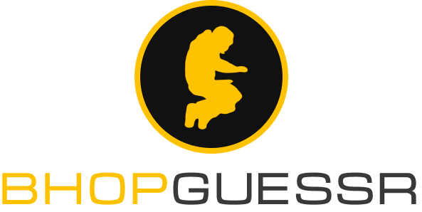

> Geoguessr analog for bhop community 🐇

 

### What's planned?

- Full `Geoguessr` analog for community movement maps from CS:S/CS:GO.
- Different map playlists.
- Easy/Medium/Hard map categories.
- Solo and 1vs1 gamemodes.
- Challenge of the day.
- Leaderboards 📊
- Bihop bot integration.
